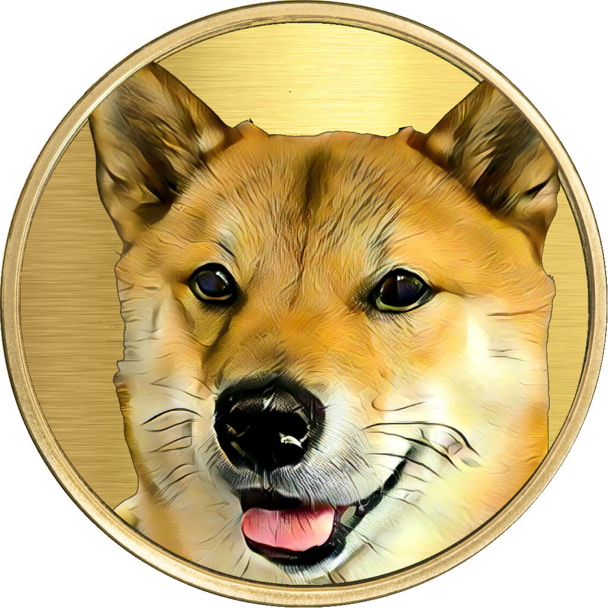

# 🎨 Art

That was our first time making artificial images with stylegan. We learned a lot about data collection, how to source images, cleaning the data and deciding what type of images should be fed to the model for the type of output that we want.

For Alpha launch, we'll use what we learned to start over and re-train the models from scratch.&#x20;

However, we made enough quality shibe faces from the first training for the Genesis Bootstrap, but they could use something a little "extra" to spruce them up.

For that little "extra", we used style transfer _and a touch of ritual magic_ to add some life to our crop.&#x20;

.png>)

Transfer learning uses a different type of AI to apply style from another image to your base image.

We wanted to try and make them look like actual coins, but when that didn't work exactly the way we hoped using style transfer, but we still like the styles.

&#x20;

With a little more elbow-grease we've got something that looks like an actual coin! 👀

### The Future

We love the idea of making lots more images that look like actual coins with actual faces of Shiba Inu. All the same, future launches of ShibeFace NFT won't be restricted by style or form. We expect to attract many different type of artists into our fold.&#x20;

The future of ShibeFace NFT could be in your hands!

&#x20;

.png>)
