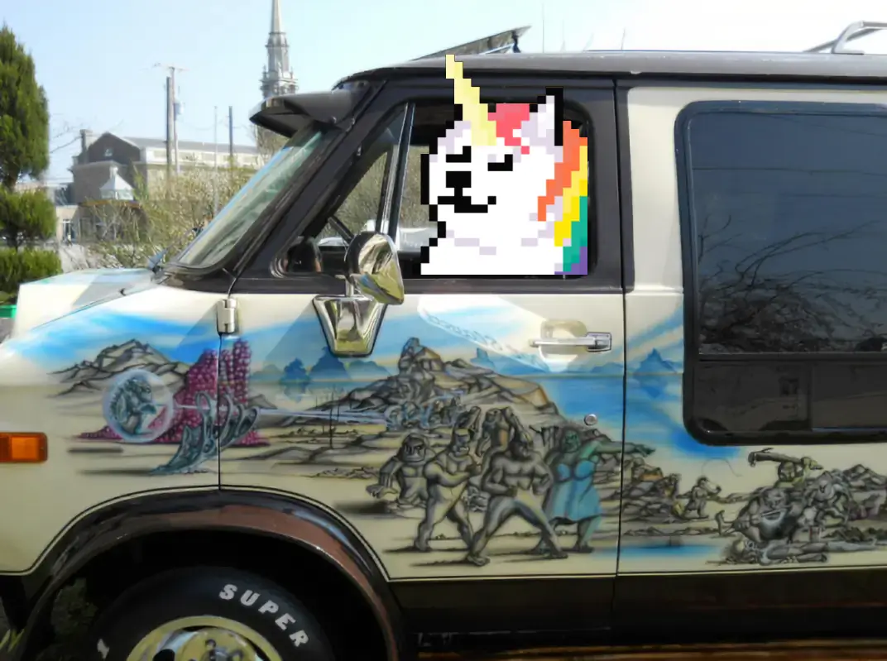
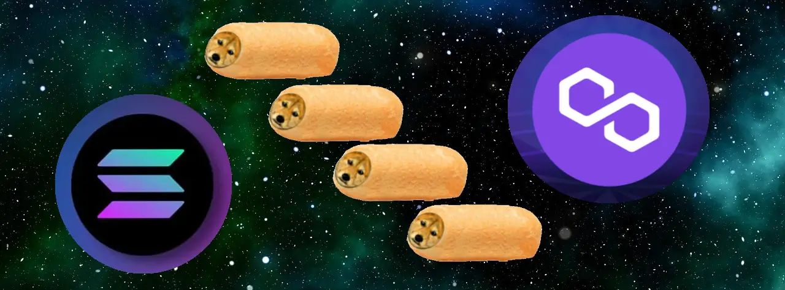

# 🤠 Roadmap

### Genesis: Ethereum

_333 NFT on the original smart contracts platform: Ethereum_


**sfSkrill Genesis collection:** Beginning a multi-chain series of NFT collections, it only makes sense to anchor our journey to the Ethereum blockchain.


_**This limited release of 333 Shibe Faced NFT**_ will launch our community and brand.

* Eligible holders gifted a corresponding NFT on successive launches (until ShibeFace DAO).
* 40% of your purchase price is added to our treasury for community development.

#### Operation: Bootstrap

The purpose to the ShibeFace Genesis Event is to jump-start our community. We have a big vision for the future, but we can't do it on our own. We'll begin by proving ourselves on the small things, and take this journey one step at a time.

**40% of purchase price added to our treasury for community development** is the primary utility for our Bootstrap sale.

Our main goal is to get this operation up and running and prepare for our "[Official Launch](broken-reference)" (a month or so after Genesis) where utility will take center stage.

We have ideas and moxy enough to get through the first few collections, but are also eager to discover what ideas you'll bring to the table.

We hope to onboard many shibes to this NFT ecosystem and bankless future!

We can grow together and, as a community, define the future of ShibeFaceDao.

#### **Hop In!**

[_**Join us**_](https://discord.gg/56J85Kk32m) for our Genesis Bootstrap event on Ethereum and become part of our inner circle leading to the opening of our cross-chain rewards-hub in 2023.

#### Key Takeaways

* Team building.
* Community development.
* 40% purchase to community development.
* Incorporate $SHIB and $DOGE Payments.
* Eligible holders gifted Companion NFT in future cross-chain collections until ShibeFaceDAO.
* Develop roadmap based on user-feedback.

### Official: Solana|Matic

_999 Shibes and a problem aint one!_

* Begin work on public data-set of Shiba Inu faces.
* Eligible purchases from this sale gifted a companion NFT from the next NFT collection.
* Each NFT mints $SKRILL tokens to HOLDers.
* Help choose which chain and utilities to feature, next.
* Prototype community DAO decision making practices.

#### **999 NFT as Time-Release Contract Wallets**

One challenge cryptocurrency traders often face is holding onto tokens long enough for their value to appreciate.

The NFT in our "official" launch will control time-released smart contract wallets that save a portion of their purchase price, denominated in $DOGE or $SHIB (synthetic \ pegged), to be released to its owner in 3-5 years.

In general, I would prefer Solana to be next, since it seems to hold the most authority among enthusiasts. Polygon, is more established, reliable, and certainly has both coins pegged and available for this use-case, but even more attractive choices may reveal themselves between now an then.

### Explore: Iota|Cardano

_3333 NFT : the world is your oyster_

.png>)

From this point, we can explore any number of blockchains, as a community.

We will have a strong sense which direction the project will pursue in the immediate future.

The core thought behind this collection would be to introduce some financially oriented games. One idea includes NFT death match, another involves a team-building scavenger hunt.

Don't want to spoil the mechanics behind those, but either path would be excellent.

#### 3333 NFT on Cardano or IOTA

* Utility:
  * NFT death match?
  * Team building scavenger hunt?
* Holder from this sale to receive a companion token on the following launch.
* Each NFT mints $SKRILL tokens to HOLDers.

### ShibeFaceDAO & Beyond!

_9999 NFT..... but where tho?_

.png>)

By this point in the journey, we should be seriously working towards ShibeFaceDAO.

The idea being that, in the beginning, the core team make most decisions and have most responsibilities, across multiple launches, gradually distribute responsibilities of operations from its centralized inception.

There are a few other chains we'd like to launch NFT on before creating a cross-chain community accelerator. That could include a total of 4-6 NFT collections before going full-DAO.

Before reaching that point, we will have demonstrated a variety of DeFi use-cases integrated with NFTs and have created a play-book of patterns for future launches.

#### Join us and help shape the future of NFT launches

Have we seen enough 10k PFP collections that try to strap utility on as an after-thought?

#### Moving Forward

* Make a public\open-source dataset of Shiba Inu faces, so anyone can train neural networks & create a multitude of artificial images based upon them.
* Support community members to participate more fully in the early days of NFT.
* Groom enthusiastic participants into community managers, web 3 techs, meme-masters, NFT designers, and other roles crucial to next gen NFT collections.
* Launch ShibeFaceDao whose purpose is:
  * Map out DeFi NFT use-cases.
  * Continue launching collections under this brand.
  * Manage the treasury and all funds from future ShibeFace NFT sales.
  * Fund the continued operation of our cross-chain community accelerator.

#### __[_Come share your thoughts on our_ discord chat server](https://discord.gg/56J85Kk32m)!

_\*Space background image by_ [_Geralt_](https://pixabay.com/users/geralt-9301/)
