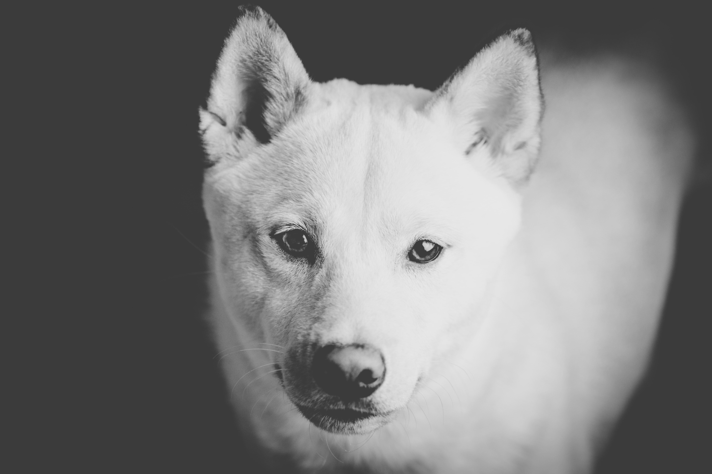

# 👥 Team

### Back Story &#x20;

FACED and 0xJPEG met during the great DeFi awakening of 2021. We had great fun (and pain) learning the wonders of this brand new multi-chain ecosystem growing rapidly all around us.

When I (FACED) conceived of creating an NFT collection, I didn't tell _anyone_ else what I was working on, but knew I had to bring 0xJPEG along for the ride.

We believe in the future of both $DOGE and $SHIB, But you may notice that FACED is more connected with the Dogecoin community, and 0xJPEG is more aligned with $SHIB.

### FACED - Founder and Bootstrap Technician

Found Bitcoin in 2016, and got caught in the mania of 2017. I've since learned everything I could about Bitcoin and cryptocurrency. &#x20;

Then I picked up some web-dev skills, and eventually hopped onto the DeFi bandwagon 2021. Later, I had the opportunity to help launch (and sell out) a 10k PFP NFT.&#x20;

It was a ton of fun and am happy for the chance to test my own ideas in the market. I love the challenges and opportunity found in permissionless innovation, Ethereum and beyond!

I've personally obsessed over every detail in creating artificial Shibes and launching these NFT, including:

* Dataset gathering, cleaning, prep. (collect shibe pictures 🥰)
* Training stylegan networks. (share shibe collection with AI)
* Learn to read Solidity, React, Typescript (React <3 Web3).
* Use web3 tool-chains to compile, deploy and test smart-contracts + their websites.
* Deploy smart contracts to test net and mint NFT. 🚀🚀🚀

_**I love to learn and to share knowledge with people who will act on it.**_&#x20;

### 0xJPEG - Market Research & JPEG Analyst

.png>)

I started my crypto journey in 2020 by watching some of the worst shills on YouTube and eventually made my way into DeFi in early 2021.

A keen observer of the market from DeFi to NFT. I have survived numerous rug-pulls: from blatant scams, to "slow rug", as well as legitimate exploits inflicted upon some of the projects I trusted my hard-earned money into.&#x20;

Spent way too much time (even during my fiat-mining duties) browsing Twitter and numerous discord channels seeking alpha, with the sole goal of becoming a meaningful contributor and builder in the Cryptoverse.

_**I believe the launch-team and community who sticks together will outlast vaporware and hype.**_&#x20;

#### **Let's build!**

### Okura Tatsuhiro - Smart Contracts + Full-Stack Expert

Passionate full-stack developer with 9+ years of experience, leadership skills and unrivaled building skills. Skilled in JS Frameworks (React, Vue), Web Dev Stacks (MEAN, LAMP), Version Control (Git), Databases (Oracle, MySQL), CMS, Blockchain, Smart Contract, Cryptography.&#x20;

I helped the bottom line at Isetan Mitsukoshi Dev, delight clients at Kajima Dev, and deliver high-quality web development for Opentext Dev. At Logica, led development for $30M in revenue per year. Managed 5 teams of 5-7 developers each. Worked with customers during the period of 15% increase in repeat business.

As a freelance developer, completed 5+ end-to-end client projects, including the webapp for the sports betting website and blockchain projects. Contributed to 40+ GitHub projects and completed 10+ personal full-stack and blockchain development projects with 95% client satisfaction.&#x20;

_**Main goal is to work with agile business owners and ambitious entrepreneurs with big ideas.**_

### Adebimpe Omolaso **- User Experience and Design**

.png>)

To me, design is a way of crafting new worlds where everyone gets to be who they really want to be deep within. I collaborate with teams or colleagues and users to design and develop products from ground up keeping in mind the final goal and strategy of the client's business. In my work, I do my best to meet my clients' expectations and deadlines while focusing on user-centric design philosophy.

**I feel a sense of deep satisfaction when user needs and business goals align.**&#x20;

### More Information

[ShibeFace](https://github.com/ShibeFaceSkrill/ShibeFaceSkrill): **** _Image by_ [_kazzzsat_](https://pixabay.com/users/kazzzsat-7677733/)__

[0xJPEG](https://twitter.com/0x\_JPEGs): _Image by_ [_Silvia Mores_](https://www.silviamores.com)__

[Okura Tatsuhiro](https://github.com/TopTecShare/): _Image by_ [_Sean Stratton_](https://unsplash.com/@seanstratton)__

[Adebimpe Omolaso](https://www.adebimpeomolaso.com)**:** _Image by_ [_Petr Magera_](https://unsplash.com/@mpetrucho)__
